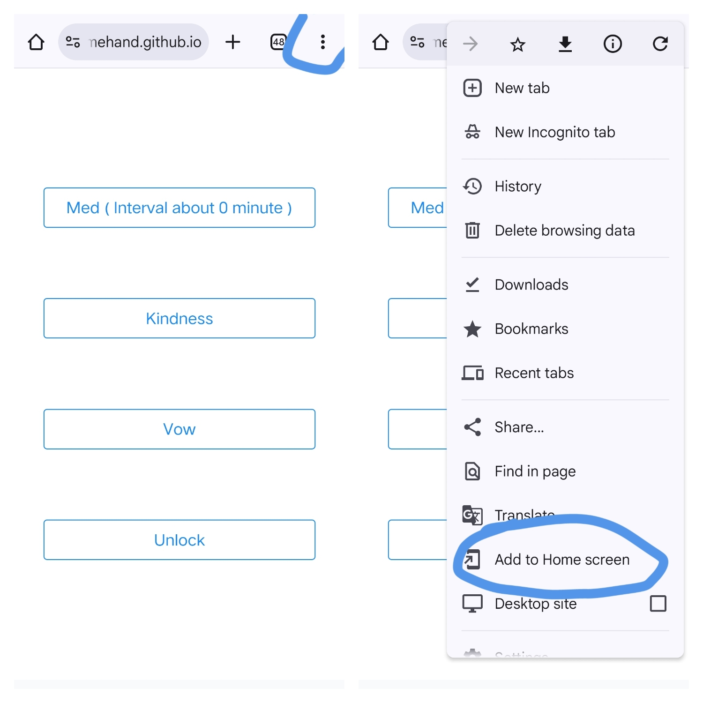
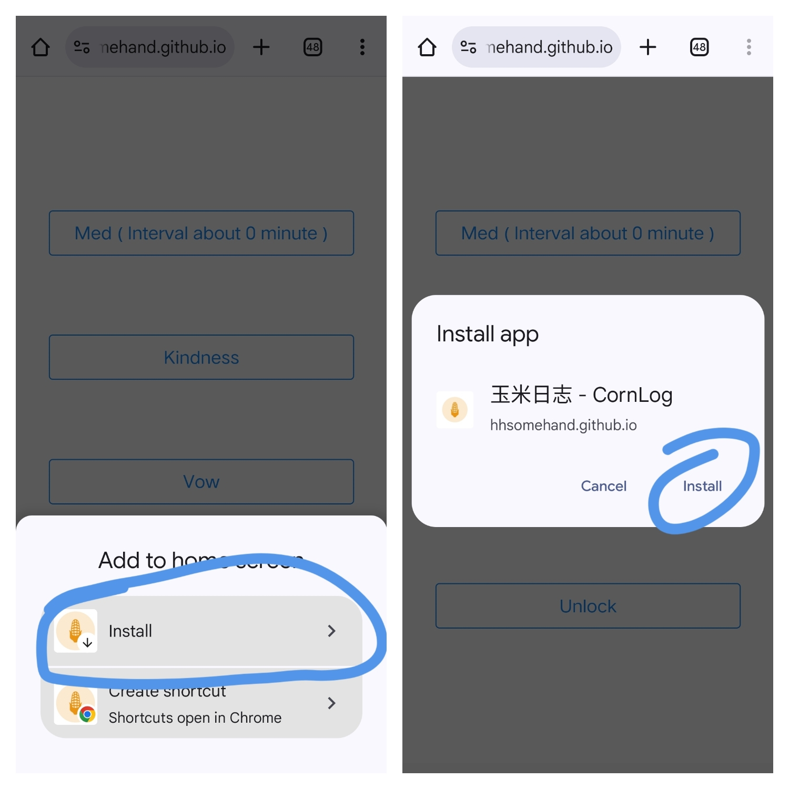
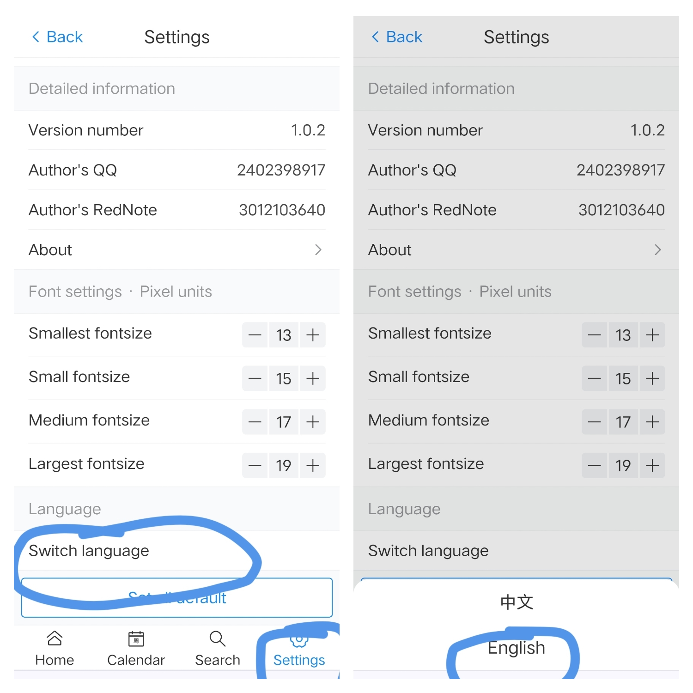

[中文版](./README_zh.md) 

# How to install?

It is recommended to use the Chrome browser to download the app, as Edge and Firefox have poor compatibility with PWA and are not recommended.

Download url: 

```
https://hhsomehand.github.io/pwa-corn-log/#/
```






Or you can access github release page to download apk! :D

## How to switch language?



# Corn Log User Manual

> **Tip**: This manual is based on an earlier version. Subsequent versions may have minor changes, but core functions remain consistent. For the best reading experience, we recommend using **Typora**.

## Adding a Log

1. Click the **+** button in the bottom right corner to enter the log input interface.
2. Enter the log content.
3. Press the **Enter key (↵)** on the keyboard or click the **"Record!"** button to save the log.


## Editing a Log

To adjust a log (e.g., to add medication time):

1. Click the log entry you wish to edit.
2. Modify the time or content, then save.


## Deleting a Log

1. Swipe left on the log entry you want to delete.
2. Click the **Delete** button that appears to confirm deletion.


## Searching Logs

1. Click the **Search** icon (magnifying glass) in the bottom navigation bar.
2. Select the search mode in the top left corner ("Log Content" or "Notes").
3. Enter keywords and click **Search** to view results.
4. Click a log entry in the results to edit or view it.


## Finding Logs by Date

1. Click the **Menu** icon (three horizontal lines, commonly called the "hamburger icon") in the top right corner, then select **"Scroll to Date"**.
2. Alternatively, click the **Calendar** icon in the bottom navigation bar, select a date, and click **Confirm**.


## Switching Modes

Corn Log offers four modes, each with different functions and support for custom modes:

- **Log**: Record daily events, the basic mode.
- **Medication**: Record medication times, display intervals, and support quick logging.
- **Abstinence**: Record relapse times, analyze abstinence duration and high-risk periods.
- **Good Deeds**: Record acts of kindness and track the total number of good deeds.

**Switching Method**:

1. Click the **Settings** icon (gear) in the bottom navigation bar.
2. Click the current mode and select another mode. Data for each mode is independent and does not interfere with other modes.

> **Suggestion**: Try each mode yourself for a more intuitive understanding!


## Enabling Privacy Mode

Logs are like diaries, and privacy is crucial. Corn Log supports a privacy mode:

1. Click the **Settings** icon (gear) in the bottom navigation bar.
2. Toggle the **Privacy Mode** switch to enable or disable it.

**Privacy Mode Features**:

- Displays four shortcut buttons:
  - **Med**: Record "medication" in Medication mode.
  - **Good**: Record "good deeds" in Good Deeds mode.
  - **Abstain**: Record "relapse" in Abstinence mode.
  - **Unlock**: Exit privacy mode (default password: `4321`).
- Ideal for quick logging in public settings while protecting privacy.


## Copying Log Content

1. Click a date to copy all log content for that day. Example:

   ```
   2025-04-20 22:35:14 sing 
   2025-04-20 22:35:18 dance 
   2025-04-20 22:35:21 rap 
   2025-04-20 22:35:25 basketball
   ```


## Data Backup

### Exporting Data

1. Go to **Settings &gt; Export**.
2. Choose an export method:
   - **Clipboard**: Copy to the clipboard and paste into a phone notepad (size limitations apply).
   - **File**: Generate a `.json` file, with no size restrictions.

### Importing Data

1. Go to **Settings &gt; Import**.
2. **Recommended**: Use the clipboard to import by copying and pasting the exported text from a notepad.
3. **File Import**: Locate a `.json` file and select it for import.


### Clearing Data

1. Go to **Settings &gt; Clear** and follow the prompts.

## Interface Customization

### Adjusting Log Entry Spacing

If the interface feels crowded, you can adjust the spacing between entries: 


### Adjusting Log Entry Height

If entries appear too short, you can increase their height:


### Setting Comment Always Display

By default, empty comments are not shown. You can set them to always display and adjust comemnt mini height: 


### Adjusting Date and Time Spacing

If the date and time are too close, you can increase the spacing:


### Setting Theme Color

Customize the interface theme color: 


### Adjusting Time Box Width and Height

Modify the width and height of the green time box next to "Today": 


### Adjusting Time Text Size

Customize the size of the time text: 


> **Explore More**: Discover other detailed features on your own.\
> \*\***Share and Feedback**: If you create a satisfying interface, feel free to share via QQ (QQ: 2402398917). Contact me if you encounter any issues!

## Frequently Asked Questions

### What if I don’t receive an update?

- Refresh multiple times or close and reopen the browser.
- **Note**: Do not delete the desktop icon and re-add it, as this may cause data loss. Always back up data before performing operations.


### What if the Abstinence mode statistics are obscured?

1. Click the **three dots** in the top right corner of the statistics interface to collapse other options.
2. Click a time period to view the corresponding frequency statistics.


the app support i18n, Localization Guide:

[click me](./doc/Localization_Guide/Localization_Guide.md)

Welcome to PR! I will merge! :)