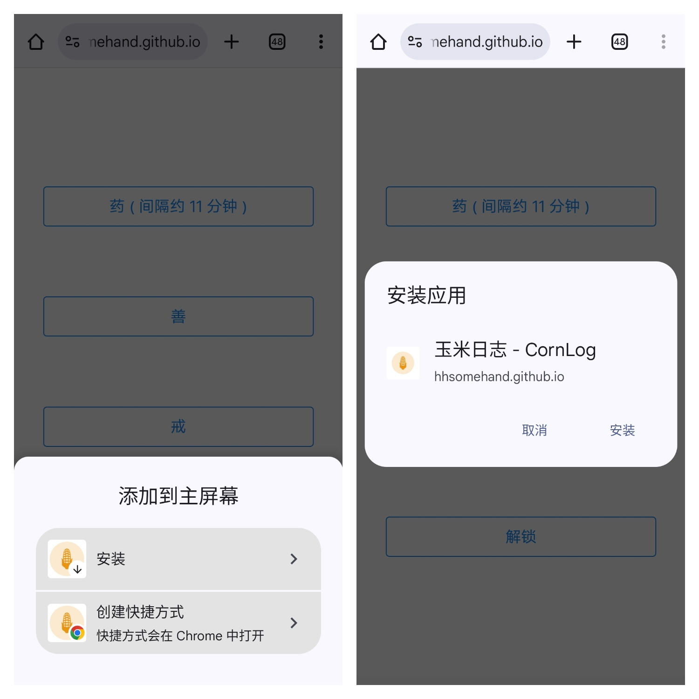
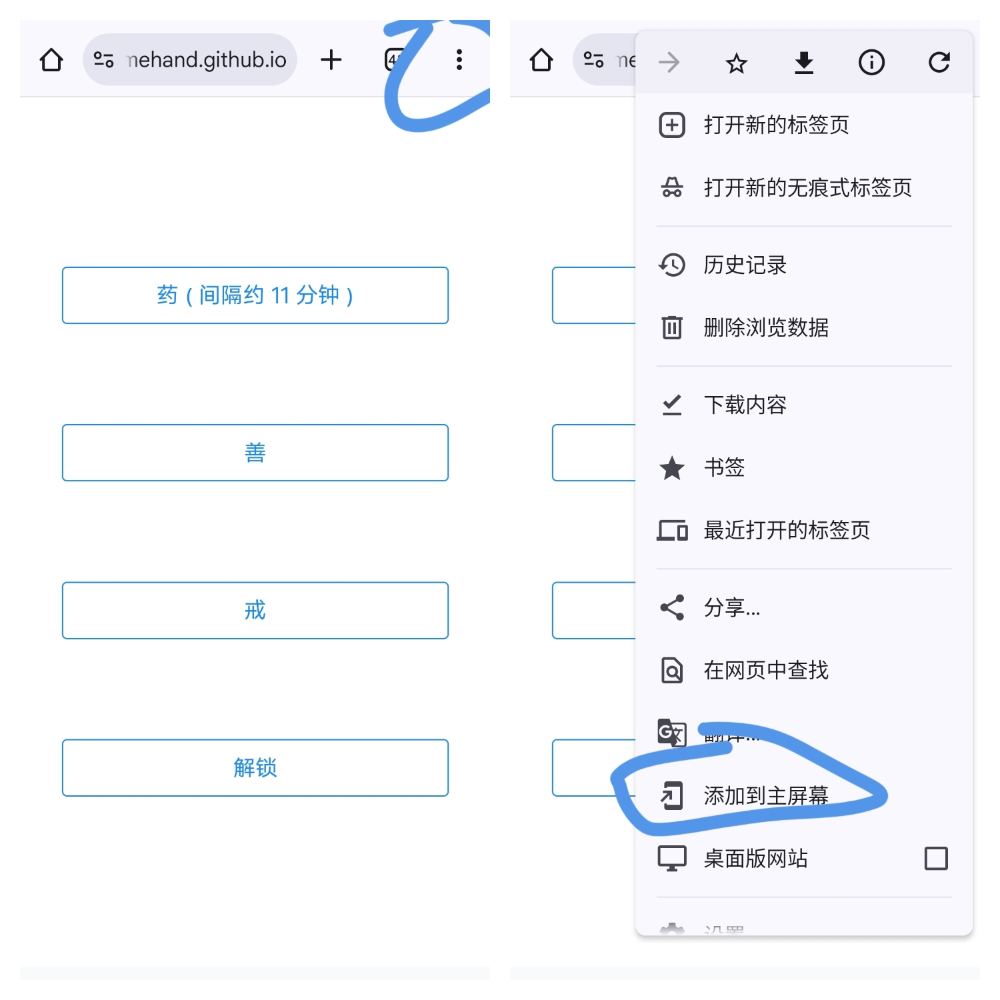

# 如何下载

> 如果无法通过浏览器安装, 可以尝试下载 APK:
>
> 软件 APK 下载地址:
>
> 蓝奏云: https://wwvs.lanzoue.com/iy3Gz2uach6d
> 密码: corn
>
> 下载的 zip 解压出来便是 apk

推荐使用 Chrome 浏览器来下载应用, Edge Firefox 对 PWA 的兼容性不好, 并不推荐

因为 Chrome 下载 PWA 应用需要使用 Google Play 服务, 所以推荐挂着梯子下载, 不然有可能无法下载

下载链接:

```
https://hhsomehand.github.io/pwa-corn-log/#/
```






或者你可以访问 Github Release 来获取 apk! :D

# 🌽 玉米日志使用手册

> **提示**：本手册基于早期版本编写，后续版本可能有细微变化，但核心功能保持一致。建议使用 **Typora** 查看以获得最佳阅读体验。

[TOC]


## 添加日志

1. 点击右下角的 **+** 按钮，进入日志输入界面。
2. 输入日志内容。
3. 按键盘上的 **回车键 (↵)** 或点击 **“记录！”** 按钮保存日志。


## 修改日志

若需调整日志（如补充服药时间）：
1. 点击需要修改的日志条目。
2. 编辑时间或内容，保存即可。


## 删除日志

1. 向左滑动需要删除的日志条目。
2. 点击出现的 **删除** 按钮确认删除。


## 搜索日志

1. 点击底部导航栏的 **搜索** 图标（放大镜）。
2. 在左上角选择搜索模式（“日志内容”或“备注”）。
3. 输入关键词，点击 **搜索** 查看结果。
4. 点击结果中的日志条目可进行编辑或查看。


## 按日期查找日志

1. 点击右上角的 **菜单** 图标（三条横线，俗称“汉堡图标”），选择 **“滚动到日期”**。
2. 或点击底部导航栏的 **日历** 图标，选择日期后点击 **确认**。


## 切换模式

玉米日志提供四种模式，每种模式功能不同，并支持自定义模式：

- **日志**：记录日常事件，基础模式。
- **药律**：记录服药时间，显示服药间隔，支持快速记录。
- **戒律**：记录破戒时间，分析戒断时长及高风险时段。
- **善举**：记录善行，统计善举总数。

**切换方法**：
1. 点击底部导航栏的 **设置** 图标（齿轮）。
2. 点击当前模式，选择其他模式。各模式数据独立，互不干扰。

> **建议**：亲自体验各模式，功能更直观！


## 开启隐私模式

日志如同日记，隐私至关重要。玉米日志支持隐私模式：
1. 点击底部导航栏的 **设置** 图标（齿轮）。
2. 切换 **隐私模式** 开关，启用或关闭。

**隐私模式功能**：
- 显示四个快捷按钮：
  - **药**：在药律模式下记录“服药”。
  - **善**：在善举模式下记录“善举”。
  - **戒**：在戒律模式下记录“破戒”。
  - **解锁**：退出隐私模式（默认密码：`4321`）。
- 适合在公共场合快速记录，保护隐私。


## 复制日志内容

1. 点击某日期，复制该日所有日志内容。
   示例：
   ```
   2025-04-20 18:30:06 除草
   2025-04-20 18:30:09 松土
   2025-04-20 18:30:12 种菜
   2025-04-20 18:30:15 浇水
   2025-04-20 18:30:18 施肥
   ```


## 数据备份

### 导出数据
1. 进入 **设置 > 导出**。
2. 选择导出方式：
   - **剪切板**：复制到剪切板，粘贴到手机记事本（有大小限制）。
   - **文件**：生成 `.json` 文件，保存无大小限制。

### 导入数据
1. 进入 **设置 > 导入**。
2. **推荐**：使用剪切板导入，复制记事本中的导出文本粘贴即可。
3. **文件导入**：搜索 `.json` 文件，选择后导入。


### 清理数据
1. 进入 **设置 > 清理**，按提示操作。

## 界面个性化

### 调整日志条目间距
若界面显得拥挤，可调整条目间距：


### 调整日志条目高度
若条目显得矮小，可增加高度：


### 设置备注显示
默认不显示空备注，可调整为恒显示，并设置备注高度：


### 调整日期与时间间距
若日期和时间靠得太近，可增加间距：


### 设置主题色
自定义界面主题色：


### 调整时间框宽高
修改“今天”旁绿色时间框的宽高：


### 调整时间文字大小
自定义时间文字大小：


> **探索更多**：其他细节功能可自行摸索。  

## 常见问题

### 更新未收到怎么办？
- 多刷新几次，关闭浏览器后重新进入。
- **注意**：不要删除桌面图标重新添加，可能导致数据丢失。操作前请备份数据。


### 戒律模式统计被遮挡怎么办？
1. 点击统计界面右上角的 **三个点** 收起其他选项。
2. 点击时间段查看对应频率统计。


本软件支持 i18n, 翻译手册:

[click me](./doc/Localization_Guide/翻译指南.md)
