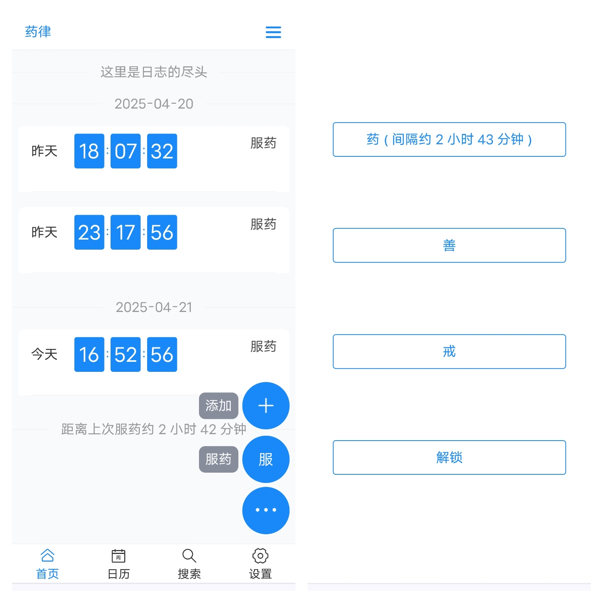
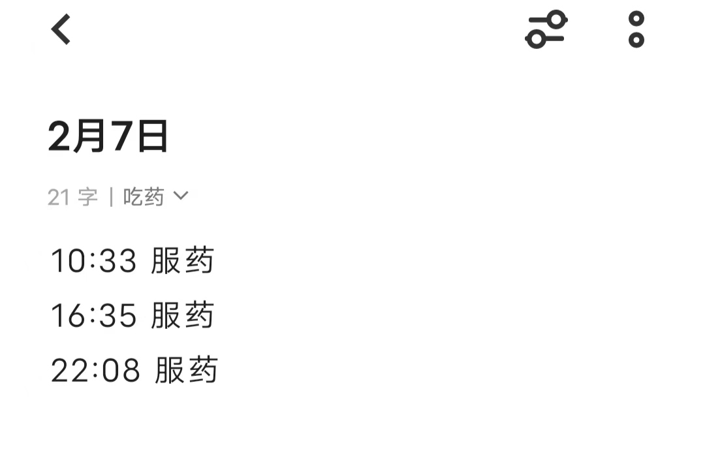
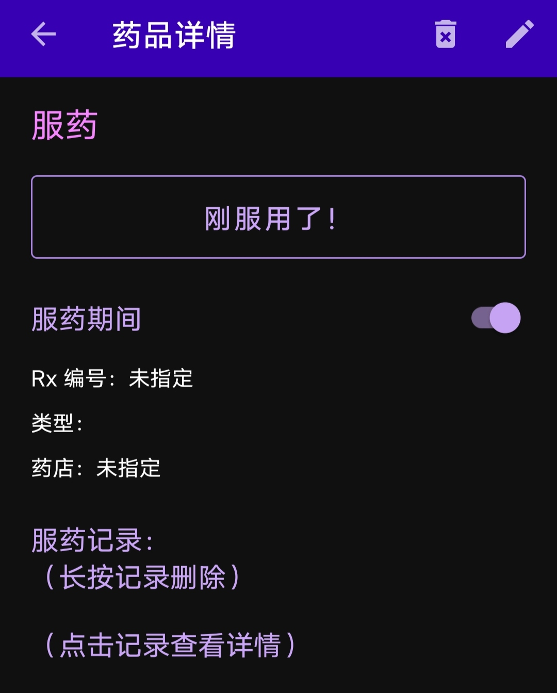

## [原创软件] 玉米日志：一款强大好用的生活记录神器

大家好！今天我满怀热情地向大家推荐一款由我亲手打造的软件——**玉米日志**！这是一款专注于服药记录、但功能远不止于此的实用工具，旨在让生活更便捷、更有条理。

---

## 写在前面：感恩社区，回馈社区

作为一个在 **52pojie** 论坛浸润多年的开发者，我深受这个社区的启发。虽然我还没能完全掌握软件绿化、魔改等“传奇技能”，但通过不断学习，我成功练就了软件开发的技艺。正所谓“投之以李，报之以桃”，我希望通过自己的努力回馈这个充满活力的社区！

我的回馈方式有两重惊喜：一是这款精心设计的 **玉米日志** 软件，二是即将推出的 **软件开发教程**，手把手带你走进开发的奇妙世界。无论你是编程新手还是老手，相信都能从中找到乐趣！

---

## 玉米日志：不仅仅是服药记录

**玉米日志** 最初是为了解决服药记录的需求而诞生，但它的功能远不止于此！无论是记录生活中的大事小事，还是助力戒烟、戒赌等目标，这款软件都能成为你的得力助手。

> **核心用途**：快速记录服药信息，避免漏服或重复服药，同时支持多种生活场景的日志记录。

---

## 软件的诞生：从痛点到解决方案

作为一名慢性病患者，我需要长期服药，但繁忙的工作和不规律的作息常常让我忘记自己是否吃过药。起初，我尝试用手机自带的笔记记录服药情况，但操作繁琐，效率低下，体验并不理想：

后来，我试用了市面上一些开源的服药提醒软件，比如“吃药没？”，但它们的操作流程依然不够简洁，无法完全满足我的需求：

“用编程解决生活问题”一直是我的理念。于是，我决定亲手开发一款真正符合我期待的软件。经过反复打磨，**玉米日志** 应运而生！它几乎实现了我对一款完美记录工具的所有设想，如今我每天都在使用它，也希望它能为更多人带来便利。

---

## 软件亮点：简单、强大、贴心

**玉米日志** 不仅实用，还充满了人性化的设计。以下是它的几大亮点：

- **一键记录，操作简便**：支持日志的增删改查，功能全面，轻松上手。
- **多场景适用**：除了服药记录，还能用于戒烟、戒赌、记录生活点滴，满足多样化需求。
- **隐私模式**：公共场合也能放心记录，保护你的隐私不尴尬。
- **高度可定制**：界面风格、功能选项随心调整，你的软件你做主！

更详细的功能说明和图文指南将在文末的 **使用手册** 中呈现，敬请期待！

---

## 如何下载：轻量便捷，随时体验

**玉米日志** 绕过了传统应用市场，采用浏览器直接下载的方式，安装包仅 **2MB**，小巧却强大！它支持 **完美离线运行**，无需联网也能流畅使用，体验媲美原生 APP，点击桌面图标即可快速打开。

**下载步骤**：
1. 使用 **Chrome 浏览器**（推荐）打开下载链接，体验最佳适配。
2. 下载完成后，安装即可使用，无需复杂配置。

> **小贴士**：Chrome 是谷歌出品的浏览器，稳定且兼容性强，建议通过手机自带的应用商店下载。Edge 和 Firefox 在部分分辨率下可能存在适配问题，暂不推荐。

---

## 开源免费：只为让生活更美好

**玉米日志** 完全 **开源且免费**！我的初衷不是为了盈利，而是希望通过编程让生活更便捷。欢迎大家体验、反馈，共同让这款软件变得更好！

---

## 背后的故事：慢工出细活

开发 **玉米日志** 的过程并非一蹴而就，而是充满了灵感与坚持。我总结了自己的开发方法论：**缓慢调整 + 积少成多**。

软件开发是一个需要耐心打磨的过程。我没有选择集中几天突击完成，而是利用零散时间，慢慢迭代。有灵感时，我会把想法记在草稿本上，攒下了厚厚一叠笔记；有时间时，再将这些灵感转化为代码。正是这种“慢工出细活”的方式，保证了软件的高质量。

除了软件本身，配套的说明书、翻译文档（支持中英双语）等内容也同样重要。这些文档同样是我一点点记录、整理，再通过 AI 润色，确保内容清晰、阅读流畅。

开发软件对我来说，不仅是解决问题，更是一种乐趣。每当一个功能被实现，那种成就感无与伦比！用编程改善生活、优化流程，是一件无比酷的事情！

---

## 软件开发教程：即将上线，敬请期待

独乐乐不如众乐乐！我已经准备好了一份详细的 **软件开发教程**，目前正在润色和完善中。不久后，它将与大家见面，带你一步步走进软件开发的精彩世界。感兴趣的朋友可以点个收听，第一时间收到更新推送！

我期望通过自己的文章，为大家提供切实的指导，让大家仅用H5就能快速实现APP的落地，释放出大家的创意，一起共同投身于APP开发的浪潮中，分享更多优质软件，一起用编程改善世界，优化日常的工作流程。

我相信，开源并非如商业领域的军事竞赛一般，是一场你死我活的零和博弈，而是互相帮助，互相温暖，互相成长的合作共赢。

我分享的APP落地流程，是一条经过我实践印证，且成功可行的道路，真心希望能给大家带来帮助!

---

## 尾声：感谢有你，一起让生活更美好

感谢你耐心读到这里！**玉米日志** 是我对社区的一份心意，也是我对编程热爱的一次实践。欢迎大家在评论区交流使用心得，如果遇到安装或使用问题，随时联系我，我很乐意手把手帮你解决！

让我们一起用 **玉米日志**，记录生活中的点滴，拥抱更健康、更美好的每一天！